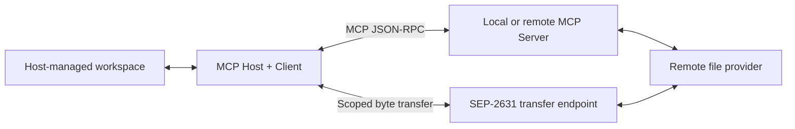
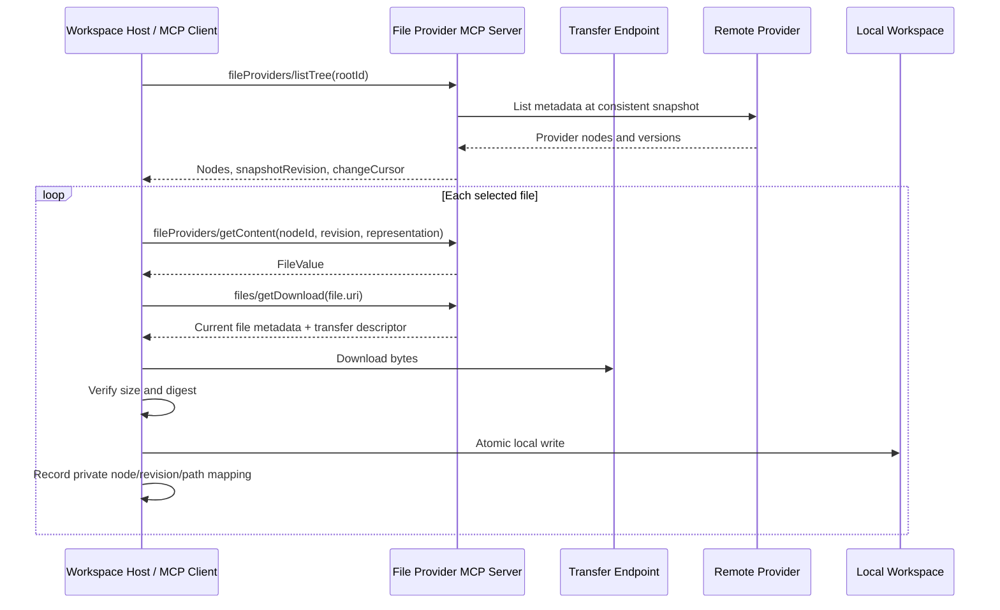
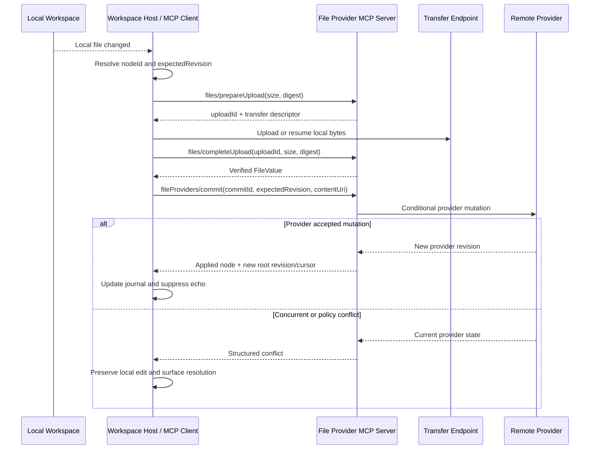

# SEP-0000: File Provider Roots and Workspace Synchronization

- **Status**: Draft
- **Type**: Standards Track
- **Created**: 2026-06-05
- **Author(s)**: Saket Saurabh <saket@openai.com>
- **Sponsor**: None
- **PR**: None

## Abstract

This SEP defines a provider-neutral MCP contract for synchronizing a bounded remote file
tree with a host-managed workspace. It standardizes provider roots, stable hierarchical
node identity, consistent snapshots, ordered change cursors, conditional mutations,
idempotent batch commits, structured conflicts, native-document representations, and
effective policy.

The protocol lets an MCP host expose ordinary local filesystem semantics to agents while
the durable source of truth remains in an external file provider such as Box, Dropbox,
Google Drive, SharePoint, OpenAI Library, or another storage service. The MCP server can
be local or remote. It owns provider integration and credentials; the MCP host owns local
path mapping, filesystem watching, atomic writes, private synchronization state, retries,
approvals, and user-visible status.

File bytes move through the transfer primitives defined by SEP-2631. This SEP does not
duplicate that data plane. Instead, it identifies the durable provider node and revision
to which transferred bytes belong.

## Motivation

MCP file transfer is sufficient for moving one immutable byte sequence between a client
and server. Reliable workspace synchronization requires additional semantics:

- File paths are mutable and cannot identify a durable remote object.
- Directory trees must be listed from a consistent point in time.
- Clients can miss notifications and need a durable recovery cursor.
- Deletes need tombstones and moves need first-class events.
- Local writes must be conditional on the remote revision that was edited.
- Multi-file edits need idempotent commits and structured partial failure.
- Native cloud documents need explicit export and import representations.
- Provider capability, user permission, and organizational policy can differ per node.
- A runtime must not silently overwrite concurrent remote changes.

Without a shared contract, each host must implement provider-specific discovery,
pagination, revision, conflict, and write-back behavior. Agents then either lose ordinary
filesystem access or depend on provider-specific save tools after every edit.

## Goals

- Let an MCP host synchronize one bounded provider root or repository.
- Preserve stable node identity across rename and move operations.
- Support complete hydration from a consistent paginated snapshot.
- Support incremental recovery through durable ordered change cursors.
- Define conditional create, update, move, and delete operations.
- Make batch retries safe through commit and operation idempotency.
- Return structured conflicts instead of silently overwriting remote changes.
- Describe original, exported, preview, and importable native-document representations.
- Keep provider credentials and provider-specific identifiers behind the MCP server.
- Work with local and remote MCP servers without granting the server direct local
  filesystem access.
- Use SEP-2631 for operation content without treating transfer handles as durable
  identity.
- Allow Git-backed adapters and native Git clients to coexist without requiring non-Git
  providers to synthesize commits, refs, or object databases.

## Non-Goals

- Standardizing host-local workspace paths, sidecar file locations, databases, or UI.
- Synchronizing a user's complete provider corpus by default.
- Replacing Git, source-control history, semantic merge, or code review.
- Requiring providers to implement every capability.
- Requiring the model to invoke a save tool after each local write.
- Exposing provider OAuth credentials, raw provider object IDs, or complete provenance to
  the model.
- Standardizing content search, comments, sharing, retention administration, or other
  provider-native workflows.
- Defining the byte-transfer data plane already covered by SEP-2631.

## Terminology and Roles

### MCP Host

The host owns the local workspace and synchronization runtime. It:

- selects and authorizes a bounded provider root;
- maps remote nodes to safe local paths;
- materializes bytes atomically;
- watches local filesystem changes;
- stores a private journal of node IDs, revisions, digests, and pending operations;
- suppresses upload/download echo loops;
- schedules retries and reconciliation;
- obtains user approval when policy requires it; and
- presents synchronization status and conflicts.

### MCP Client

The client is created by the host and communicates with exactly one MCP server. It sends
the methods defined by this SEP and uses SEP-2631 transfer descriptors to move bytes.

### MCP Server

The server implements the normalized provider contract. It can be a local process or a
remote service. It:

- authenticates and authorizes every request;
- retains provider credentials in trusted server-side storage;
- translates provider metadata and operations into this SEP's shapes;
- maintains or derives stable normalized node identity;
- issues consistent snapshots and durable change cursors;
- performs conditional provider mutations; and
- issues SEP-2631 file transfer handles for content.

### Provider Adapter and Provider

A provider adapter is an implementation component behind the MCP server. The provider is
the external system of record. Neither is an additional MCP JSON-RPC peer.

### Local and Remote Deployment

This SEP supports both deployment forms:



The MCP server never requires arbitrary access to the host filesystem. The host reads and
writes local files; the server reads and writes provider state.

## Relationship to Git

Git is the preferred protocol when a root is already a Git repository and the client
needs Git semantics such as durable history, branches, merges, patches, code review, or
offline distributed development. This SEP does not require clients to access such roots
through `fileProviders/*`, and it does not attempt to replace native Git transports.

A Git-backed MCP server can still implement this SEP when a host needs a provider-neutral
workspace abstraction. It can map a selected ref to a provider root, commits or trees to
root revisions, and blobs to file content. The adapter remains responsible for preserving
Git's stronger semantics; clients **MUST NOT** assume that every provider root has commit
history, branches, merge bases, or content-addressed node identity merely because a Git
adapter can supply them.

Git is not the universal provider contract for this SEP because many target systems are
mutable object stores rather than repositories:

- A provider file has stable object identity across rename and move. Git records paths in
  trees and normally infers renames from similar delete/create pairs rather than storing a
  durable file identity.
- Providers expose per-object revisions, permissions, retention rules, and change feeds.
  Git primarily coordinates immutable object graphs through mutable refs.
- Native cloud documents can require explicit export and import representations and may
  not have canonical transferable source bytes.
- Provider roots can enforce per-node no-copy, no-cache, no-index, or conditional
  write-back policy that does not map naturally to a cloned object database.
- Automatically translating filesystem events into Git commits would introduce commit
  authorship, messages, history retention, branching, and merge policy that the provider
  and user did not request.
- Large binary content, partial hydration, and provider-side conversion often require a
  separate data plane even when Git or Git LFS is used.

Clients can therefore choose native Git for repository-shaped roots and this SEP for
provider-shaped roots. A product can support both paths and select between them based on
the root's advertised capabilities and the user's workflow.

### Git-Inspired Semantics

This SEP deliberately adopts several Git design principles without adopting Git's full
repository model:

| Git concept                           | SEP analogue                                                   | Adaptation                                                                                             |
| ------------------------------------- | -------------------------------------------------------------- | ------------------------------------------------------------------------------------------------------ |
| Immutable blobs identified by content | `FileDigest` on transferred content                            | Integrity and deduplication are separate from mutable provider node identity.                          |
| Tree snapshots                        | `snapshotRevision` and hierarchical `FileProviderNode` results | Pagination remains pinned to one provider snapshot even when the provider changes concurrently.        |
| Compare-and-swap ref updates          | `expectedRevision` and optional `baseRevision`                 | Preconditions apply per node or root instead of only to a branch ref.                                  |
| Atomic reference transactions         | `all_or_nothing` batch commits                                 | Providers can apply a related mutation set atomically when supported.                                  |
| Index or staging area                 | Host-private journal and pending operation queue               | Local edits are collected deterministically before an explicit conditional commit.                     |
| Fetch negotiation and partial clone   | Selective listing and lazy `getContent`                        | Hosts can hydrate only needed metadata or bytes without requiring a complete object database.          |
| Reflog and commit history             | Durable change cursor and ordered change records               | The feed supports recovery and deduplication but is not required to be permanent user-visible history. |
| Push rejection and merge conflicts    | Structured operation conflicts                                 | The protocol prevents silent overwrite while leaving text or semantic merge to the host or provider.   |
| Separate Git LFS object transfer      | SEP-2631 control/data-plane separation                         | Durable provider identity does not depend on an expiring byte-transfer URL.                            |

Two Git behaviors are intentionally not copied. Renames are first-class provider events
that preserve `nodeId`, rather than similarity-based inference. Provider revisions and
change cursors are opaque values, rather than hashes clients can parse or recompute.

## Specification

### 1. Capabilities

Servers advertise a `fileProviders` capability through `server/discover`:

```json
{
  "capabilities": {
    "fileProviders": {
      "roots": {},
      "snapshots": {},
      "changes": {},
      "commits": {},
      "notifications": {}
    }
  }
}
```

Clients declare supported behavior in per-request capabilities:

```json
{
  "io.modelcontextprotocol/clientCapabilities": {
    "fileProviders": {
      "notifications": true,
      "partialCommits": true,
      "nativeDocuments": true
    }
  }
}
```

Servers **MUST NOT** infer client capabilities from earlier requests. Provider operations
that include content require mutually supported SEP-2631 transfer capabilities.

### 2. Common Types

```ts
type ProviderRevision = string;
type ChangeCursor = string;

interface FileProviderRoot {
  rootId: string;
  displayName: string;
  kind: "repository" | "folder" | "drive" | string;
  rootNodeId: string;
  headRevision: ProviderRevision;
  changeCursor: ChangeCursor;
  capabilities: FileProviderCapabilities;
  policy: FileProviderPolicy;
}

interface FileProviderCapabilities {
  list: boolean;
  read: boolean;
  changes: boolean;
  createFile: boolean;
  createDirectory: boolean;
  updateFile: boolean;
  move: boolean;
  delete: boolean;
  batchCommit: boolean;
  atomicBatchCommit: boolean;
  nativeDocuments: boolean;
  notifications: boolean;
  maxPageSize?: number;
  maxBatchOperations?: number;
}

interface FileProviderPolicy {
  readOnly: boolean;
  copy: "allowed" | "forbidden";
  cache: "forbidden" | "ephemeral" | "persistent";
  index: "forbidden" | "provider" | "client";
  writeBack: "forbidden" | "conditional";
}
```

`rootId`, revisions, and cursors are opaque server-issued values. They **MUST NOT** embed
credentials. Servers **SHOULD** expose normalized identifiers rather than raw provider
object IDs. Clients **MUST NOT** parse them.

### 3. Stable Nodes

```ts
interface FileProviderNode {
  rootId: string;
  nodeId: string;
  parentNodeId?: string;
  name: string;
  kind: "file" | "directory";
  revision: ProviderRevision;
  createdAt?: string;
  modifiedAt?: string;
  mimeType?: string;
  size?: number;
  digest?: FileDigest;
  representations?: FileRepresentation[];
  capabilities: EffectiveNodeCapabilities;
  policy: FileProviderPolicy;
}

interface EffectiveNodeCapabilities {
  read: boolean;
  update: boolean;
  move: boolean;
  delete: boolean;
  createChildren: boolean;
}

interface FileRepresentation {
  representationId: string;
  kind: "original" | "export" | "preview" | string;
  mimeType: string;
  sourceRevision: ProviderRevision;
  writable: boolean;
  lossy?: boolean;
  suggestedExtension?: string;
}
```

`nodeId` is stable within a root. A rename or move **MUST** preserve `nodeId`. `name` is a
single path segment, not a local path. Clients construct local paths from parent
relationships under host policy.

Effective capabilities combine provider support, root policy, node type, file type, user
permission, and current provider state. Clients **MUST** use effective capabilities rather
than assuming every node inherits the root's maximum capabilities.

### 4. Listing Provider Roots

`fileProviders/listRoots` returns bounded roots available to the authenticated principal.
It is paginated using the standard MCP cursor fields.

```ts
interface ListFileProviderRootsRequest extends PaginatedRequest {
  method: "fileProviders/listRoots";
}

interface ListFileProviderRootsResult extends PaginatedResult {
  roots: FileProviderRoot[];
}
```

A root can represent an entire small repository, a selected folder, a project-specific
drive, or another administratively bounded tree. Servers **SHOULD NOT** expose a global
enterprise corpus as one synchronizable root unless it is intentionally bounded and the
provider can support the required snapshot and change semantics.

### 5. Consistent Tree Snapshots

`fileProviders/listTree` lists nodes from one consistent snapshot:

```ts
interface ListFileProviderTreeRequestParams extends PaginatedRequestParams {
  rootId: string;
  snapshotRevision?: ProviderRevision;
  parentNodeId?: string;
  depth?: number;
  pageSize?: number;
}

interface ListFileProviderTreeRequest extends JSONRPCRequest {
  method: "fileProviders/listTree";
  params: ListFileProviderTreeRequestParams;
}

interface ListFileProviderTreeResult extends PaginatedResult {
  rootId: string;
  snapshotRevision: ProviderRevision;
  nodes: FileProviderNode[];
  changeCursor: ChangeCursor;
}
```

On the first page, the client can omit `snapshotRevision`. The server selects a snapshot
and returns its revision. The client **MUST** send that revision on every subsequent page.
The server **MUST** return nodes from the same logical snapshot or fail with
`snapshotExpired`. It **MUST NOT** silently continue pagination against a newer tree.

`changeCursor` represents the first change position after the returned snapshot. A client
that completes hydration can begin incremental reconciliation from this cursor without a
gap.

Pagination cursors are opaque positions within one snapshot. They are not durable change
cursors and **MUST NOT** be used for incremental synchronization.

### 6. Reading Node Content

`fileProviders/getContent` returns a SEP-2631 `FileValue` for an exact node revision and
representation:

```ts
interface GetFileProviderContentRequestParams extends RequestParams {
  rootId: string;
  nodeId: string;
  revision: ProviderRevision;
  representationId?: string;
}

interface GetFileProviderContentRequest extends JSONRPCRequest {
  method: "fileProviders/getContent";
  params: GetFileProviderContentRequestParams;
}

interface GetFileProviderContentResult extends Result {
  node: FileProviderNode;
  representation: FileRepresentation;
  file: FileValue;
}
```

The server **MUST** either return content corresponding exactly to `revision` or return a
`nodeRevisionMismatch` conflict. It **MUST NOT** silently substitute newer bytes.

For this SEP, the returned `FileValue` **MUST** include its byte size and a `sha-256`
digest so the host can verify that materialized bytes match the selected node revision.

The host resolves `file.uri` through `files/getDownload`, verifies available size and
digest metadata, and writes the file atomically. The host privately records `rootId`,
`nodeId`, node revision, representation, and digest for later reconciliation.

### 7. Ordered Change Feed

`fileProviders/getChanges` returns durable ordered changes after a cursor:

```ts
interface GetFileProviderChangesRequestParams extends RequestParams {
  rootId: string;
  afterCursor: ChangeCursor;
  limit?: number;
}

interface GetFileProviderChangesRequest extends JSONRPCRequest {
  method: "fileProviders/getChanges";
  params: GetFileProviderChangesRequestParams;
}

interface GetFileProviderChangesResult extends Result {
  rootId: string;
  changes: FileProviderChange[];
  nextCursor: ChangeCursor;
  headRevision: ProviderRevision;
  hasMore: boolean;
}

interface FileProviderChange {
  changeId: string;
  revision: ProviderRevision;
  nodeId: string;
  kind: "created" | "updated" | "moved" | "deleted";
  previous?: FileProviderNode;
  current?: FileProviderNode;
  tombstone?: FileProviderTombstone;
}

interface FileProviderTombstone {
  rootId: string;
  nodeId: string;
  revision: ProviderRevision;
  previousParentNodeId?: string;
  previousName: string;
  deletedAt?: string;
}
```

Changes are ordered by the root's revision sequence. Delivery can be at least once;
clients deduplicate by `changeId`. `nextCursor` advances past every returned change,
including changes the client has already seen.

Moves **MUST** be represented as `moved` changes preserving `nodeId`, with previous and
current parent/name metadata. Servers **MUST NOT** reduce a provider move to unrelated
delete and create events when stable provider identity is available.

Deletes **MUST** include tombstones sufficient to remove or conflict the prior local
mapping. Servers retain cursors and tombstones for a documented bounded period. If an
`afterCursor` can no longer be served, the server returns `cursorExpired` and the client
performs a new snapshot reconciliation.

### 8. Notifications Are Hints

Servers that advertise notifications can emit:

```ts
interface FileProviderChangedNotificationParams extends NotificationParams {
  rootId: string;
  headRevision?: ProviderRevision;
}

interface FileProviderChangedNotification extends JSONRPCNotification {
  method: "notifications/fileProviders/changed";
  params: FileProviderChangedNotificationParams;
}
```

The notification indicates only that the client should call `getChanges`. It is not a
change event, ordering mechanism, or recovery mechanism. Clients **MUST** reconcile from
their durable cursor after reconnect, restart, timeout, or suspected notification loss.

### 9. Conditional Batch Commits

Hosts submit local changes through `fileProviders/commit`:

```ts
interface CommitFileProviderRequestParams extends RequestParams {
  rootId: string;
  commitId: string;
  baseRevision?: ProviderRevision;
  atomicity: "all_or_nothing" | "apply_non_conflicting";
  operations: FileProviderOperation[];
}

interface CommitFileProviderRequest extends JSONRPCRequest {
  method: "fileProviders/commit";
  params: CommitFileProviderRequestParams;
}

type FileProviderOperation =
  | CreateFileOperation
  | CreateDirectoryOperation
  | UpdateFileOperation
  | MoveNodeOperation
  | DeleteNodeOperation;

interface OperationBase {
  operationId: string;
}

interface CreateFileOperation extends OperationBase {
  kind: "createFile";
  parentNodeId: string;
  name: string;
  expectedAbsent: true;
  contentUri: string;
  importRepresentationId?: string;
}

interface CreateDirectoryOperation extends OperationBase {
  kind: "createDirectory";
  parentNodeId: string;
  name: string;
  expectedAbsent: true;
}

interface UpdateFileOperation extends OperationBase {
  kind: "updateFile";
  nodeId: string;
  expectedRevision: ProviderRevision;
  contentUri: string;
  importRepresentationId?: string;
}

interface MoveNodeOperation extends OperationBase {
  kind: "move";
  nodeId: string;
  expectedRevision: ProviderRevision;
  newParentNodeId: string;
  newName: string;
}

interface DeleteNodeOperation extends OperationBase {
  kind: "delete";
  nodeId: string;
  expectedRevision: ProviderRevision;
  recursive?: boolean;
}
```

`contentUri` references a completed SEP-2631 upload. It is operation content, not the
identity of the target node. Servers **MUST** reject incomplete, expired, unauthorized,
or integrity-invalid transfer handles.

Every update, move, and delete operation includes the node revision on which the local
operation was based. Creates include `expectedAbsent`. Servers **MUST NOT** silently
overwrite a newer revision or an existing path.

`baseRevision` provides an optional root-level precondition for clients that need a
repository-wide compare-and-swap. Per-operation preconditions remain authoritative for
independent operations.

### 10. Commit Results and Conflicts

```ts
interface CommitFileProviderResult extends Result {
  rootId: string;
  commitId: string;
  applied: boolean;
  previousRevision: ProviderRevision;
  newRevision?: ProviderRevision;
  nextCursor?: ChangeCursor;
  operations: FileProviderOperationResult[];
  conflicts: FileProviderConflict[];
}

interface FileProviderOperationResult {
  operationId: string;
  status: "applied" | "conflict" | "rejected";
  node?: FileProviderNode;
  changeId?: string;
}

interface FileProviderConflict {
  operationId: string;
  reason:
    | "rootRevisionMismatch"
    | "nodeRevisionMismatch"
    | "pathAlreadyExists"
    | "nodeMissing"
    | "parentMissing"
    | "directoryNotEmpty"
    | "permissionDenied"
    | "policyDenied"
    | "providerCapabilityMissing"
    | "representationNotWritable";
  expected?: unknown;
  actual?: unknown;
  currentNode?: FileProviderNode;
  suggestedResolution?:
    | "refreshAndRetry"
    | "renameLocalCopy"
    | "manualMerge"
    | "requestPermission"
    | "importCopyInstead";
}
```

For `all_or_nothing`, any conflict prevents all operations from applying. For
`apply_non_conflicting`, the server applies independent valid operations and returns
conflicts for the remainder.

The server **MUST** process repeated commits with the same `commitId` and equivalent
parameters as one logical commit. Reusing a `commitId` with materially different
parameters fails with `idempotencyConflict`. `operationId` identifies results within the
commit and supports safe provider-level retries.

The server **SHOULD** return current node metadata and revisions when policy permits so
the host can create a conflict copy, refresh, or present a manual merge workflow.

### 11. Native Cloud Documents

Providers can store documents whose original representation is not a normal local file.
Servers describe usable representations through `FileRepresentation`.

- `original` represents provider-native content when transferable.
- `export` represents a materialized format such as PDF, DOCX, XLSX, or plain text.
- `preview` is read-only and not suitable for write-back.
- `sourceRevision` binds every representation to the node revision from which it was
  generated.
- `writable` indicates whether bytes in that representation can be imported back.
- `lossy` indicates that round-trip fidelity is not guaranteed.

Clients select a representation explicitly when multiple formats are available. They
**MUST NOT** assume that editing an exported representation can update the native
document. An update or create operation that imports content identifies
`importRepresentationId`; the server validates that the representation is writable and
that provider policy allows conversion.

If write-back is unsupported, the host can preserve the edited local file as a conflict
copy or create a new provider file when policy and user intent allow it. It **MUST NOT**
silently replace the native document with a lossy export.

### 12. Policy Semantics

Policy travels with roots and nodes:

- `readOnly` prohibits all mutations.
- `copy: forbidden` prohibits persistent local materialization. A host can still support
  transient streaming when another protocol surface permits it.
- `cache` controls whether transferred bytes can be retained after the immediate task.
- `index` controls whether content can be indexed by the provider or client.
- `writeBack: conditional` permits only revision-checked mutations.

The server computes effective policy from provider rules, user permissions,
organizational policy, root configuration, and file type. Hosts **MUST** enforce returned
policy locally and **MUST** expect the server to revalidate it at operation time.

### 13. Host Synchronization Responsibilities

The following behavior is intentionally host-owned and is not standardized as remote MCP
methods:

- choosing a local root and mapping remote nodes to relative paths;
- normalizing names for the local operating system and handling collisions;
- preventing path traversal and unsafe symlink behavior;
- staging downloads in temporary files, verifying integrity, and atomically renaming;
- watching local files and detecting create, modify, move, and delete operations;
- maintaining a private sync journal and pending operation queue;
- detecting local renames from node mappings and filesystem identity;
- suppressing changes caused by the host's own downloads or successful uploads;
- scheduling retries and periodic remote reconciliation;
- obtaining approvals for durable mutations; and
- showing progress, errors, conflicts, and last-synchronized state.

Provider IDs, node revisions, change cursors, transfer capabilities, and detailed
provenance **SHOULD** remain in host-private state. The model can receive a safe summary
or opaque user-facing reference when it needs to choose an action.

## End-to-End Flows

### Remote-to-Local Hydration



### Local-to-Remote Write-Back



### Incremental Recovery

1. The host persists the last fully applied `ChangeCursor` outside the container process
   when workspace continuity requires it.
2. On notification, timer, restart, or reconnect, it calls `getChanges` with that cursor.
3. It applies changes in order, advancing the persisted cursor only after corresponding
   local state and journal updates are durable.
4. If the cursor expired, it requests a new snapshot, compares stable node IDs and
   revisions against local journal state, and preserves unsynchronized local edits as
   conflicts.

## Lifecycle, Retry, and Conflict Semantics

- Snapshot pagination is repeatable within one `snapshotRevision`.
- Change delivery is at least once and ordered within a root.
- Provider commit retries are idempotent. A failed upload can be retried with a new
  upload handle.
- Transfer URLs can expire independently of file, upload, root, and node handles.
- A host can resolve a fresh download descriptor without changing durable node identity.
- The host advances its change cursor only after durable local application.
- The server rechecks authorization, policy, capabilities, and revisions at commit time.
- Concurrent remote changes never result in silent overwrite.
- Hosts preserve unresolved local bytes until the user or policy chooses refresh,
  conflict copy, merge, or discard.

## Error Handling

In addition to standard JSON-RPC errors, servers return machine-readable reasons:

- `unknownRoot`
- `unknownNode`
- `snapshotExpired`
- `cursorExpired`
- `nodeRevisionMismatch`
- `rootRevisionMismatch`
- `idempotencyConflict`
- `policyDenied`
- `permissionDenied`
- `providerUnavailable`
- `providerRateLimited`
- `providerCapabilityMissing`
- `representationNotFound`
- `representationNotWritable`
- `transferRequired`
- `transferInvalid`

Transient provider failures can include `retryAfterMs`. Clients retry with bounded
exponential backoff and jitter. Clients **MUST NOT** blindly retry conflicts or policy
errors.

## Security and Privacy

- MCP authorization protects the control plane when the server is remote.
- Provider OAuth credentials, refresh tokens, cookies, and service-account credentials
  **MUST** remain in the MCP server or trusted provider adapter.
- Provider credentials **MUST NOT** be embedded in root IDs, node IDs, cursors,
  notifications, transfer descriptors, or errors.
- Servers **MUST** authorize every root, node, content, change, and commit request against
  the current authenticated principal.
- Hosts **MUST** scope local materialization to the selected root and prevent names from
  escaping the workspace through traversal, reserved paths, symlinks, or platform path
  normalization.
- Hosts **MUST** follow SEP-2631 bearer-capability and integrity requirements when
  transferring operation content. They also **MUST** apply host egress, redirect, SSRF,
  and ambient-credential policy to transfer endpoints.
- Durable provider identity and revisions **SHOULD** remain host-private rather than
  model-visible by default.
- Servers and hosts **SHOULD** audit cross-scope copies, durable writes, deletes, native
  document conversion, and conflict resolution.
- `copy`, `cache`, and `index` policy **MUST** remain enforceable after bytes reach the
  host. A host that cannot satisfy policy must decline synchronization.

## Backward Compatibility

This proposal is additive. Existing MCP servers can continue exposing provider-specific
tools. Clients detect support through capabilities and can fall back to on-demand list,
read, or materialize tools when synchronization is unavailable.

SEP-2631 remains independently useful for generated artifacts and one-shot file inputs.
Implementing this SEP requires SEP-2631 only for operations that transfer content.

## Testing Plan

Conforming implementations should test:

- local and remote MCP server deployments;
- consistent pagination while the provider tree changes concurrently;
- initial hydration followed by gap-free changes from the returned cursor;
- duplicate and out-of-order notification handling;
- at-least-once change delivery and `changeId` deduplication;
- first-class moves preserving `nodeId`;
- delete tombstones and cursor-expiry full reconciliation;
- idempotent full and partial commit retries;
- create/update/move/delete revision conflicts;
- remote changes racing with unsynchronized local edits;
- native-document export selection and rejected lossy write-back;
- policy combinations including read-only, no-copy, no-cache, and no-index;
- expired SEP-2631 descriptors without loss of durable node identity;
- server replica changes during uploads, reads, changes, and commits;
- provider authorization revocation during an active workspace lifecycle; and
- path traversal, normalization collision, and unsafe symlink defenses.

## Alternatives Considered

### Use Git as the Universal Provider Protocol

Native Git is a better choice for roots that already have repository semantics. It was
not selected as the universal contract because requiring every Box folder, Drive, native
cloud document, or object store to synthesize blobs, trees, commits, refs, and merge
history would add semantics those providers do not possess. It would also lose or
externalize stable provider object identity, per-node policy, native representations, and
provider change cursors.

Implementations **MAY** expose both a native Git endpoint and this SEP. They should avoid
creating a synthetic Git history solely to satisfy workspace synchronization when the
underlying provider has no user-visible source-control model.

### Put Synchronization Directly in SEP-2631

Rejected because byte transfer and durable repository synchronization have different
adoption and implementation requirements. A server can support file inputs and generated
outputs without implementing trees, changes, or mutations.

### Use Resource Subscriptions as the Change Feed

Rejected because notifications can be missed and resource subscriptions do not define a
durable total order, snapshot boundary, move event, tombstone, or recovery cursor.
Notifications remain useful wake-up hints.

### Use Paths as Identity

Rejected because paths change during rename and move, collide under platform-specific
normalization, and cannot safely identify conditional write-back targets.

### Let the Model Call Provider Save Tools

Rejected as the common synchronization path because it breaks ordinary filesystem
workflows and relies on the model to preserve hidden identity and revision metadata. The
host detects and commits local changes deterministically.

### Require a Local Provider Sidecar

Rejected because MCP already supports remote servers. A remote adapter better isolates
provider credentials and supports headless or ephemeral containers. Local sidecars remain
a valid deployment choice.

## Open Questions

- Should provider roots be first-class core MCP primitives or an optional extension?
- What minimum cursor retention period should a conforming server document or provide?
- Should atomic directory moves and recursive deletes be required for roots that advertise
  atomic batch commits?
- Should the protocol define a preflight method for very large commits?
- Should representation conversion quality or fidelity receive standardized metadata?
- Should advisory locks or leases be standardized in a later SEP for providers that
  support collaborative editing?
- How should a host communicate user-approved write-back intent without standardizing
  product-specific approval UI?

## Related Work

- [Git objects](https://git-scm.com/book/en/v2/Git-Internals-Git-Objects): immutable
  blobs, trees, and commits.
- [Git protocol v2](https://git-scm.com/docs/protocol-v2): capability advertisement,
  reference discovery, and fetch negotiation.
- [Git partial clone](https://git-scm.com/docs/partial-clone): filtered object transfer
  and lazy retrieval from promisor remotes.
- [Git update-ref](https://git-scm.com/docs/git-update-ref): compare-and-swap and atomic
  reference transactions.
- [Git diffcore](https://git-scm.com/docs/gitdiffcore): similarity-based rename and copy
  detection.
- [SEP-2631](https://github.com/modelcontextprotocol/modelcontextprotocol/pull/2631):
  file objects and transfer.
- [SEP-2575](/seps/2575-stateless-mcp): stateless MCP and per-request capabilities.
- [SEP-2567](/seps/2567-sessionless-mcp): sessionless MCP and explicit state handles.
- [SEP-2549](/seps/2549-TTL-for-list-results): cache lifetimes and invalidation hints.
- [SEP-2322](/seps/2322-MRTR): multi round-trip requests.
